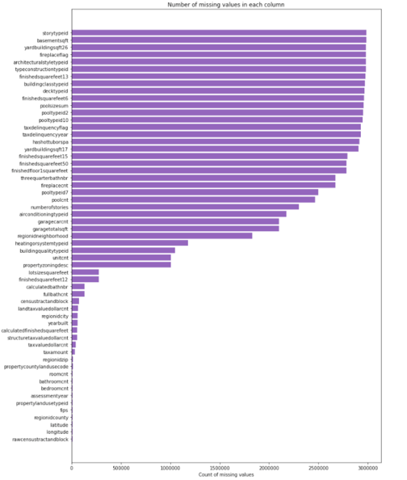
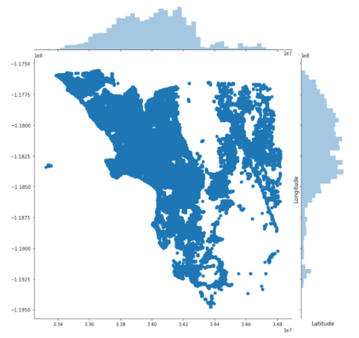
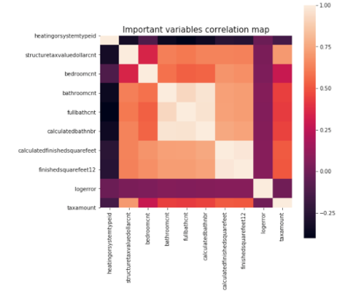
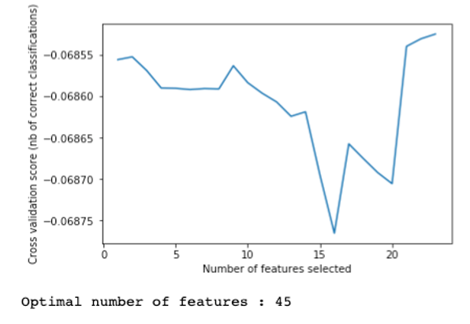
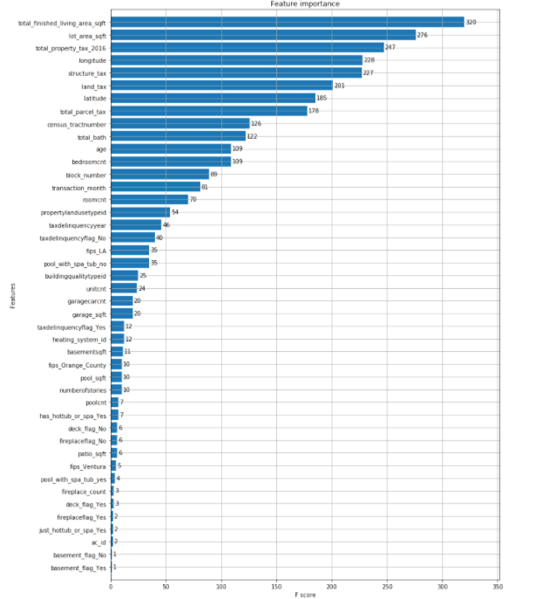
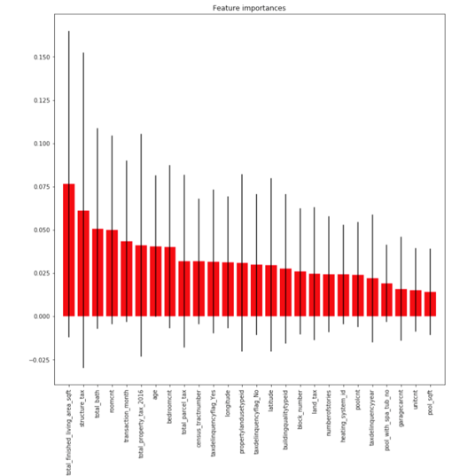
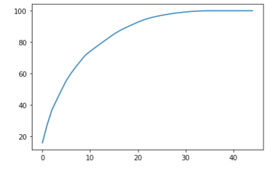
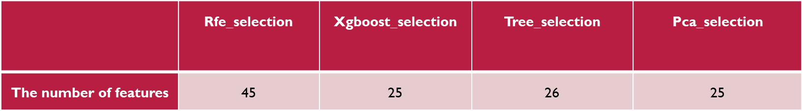
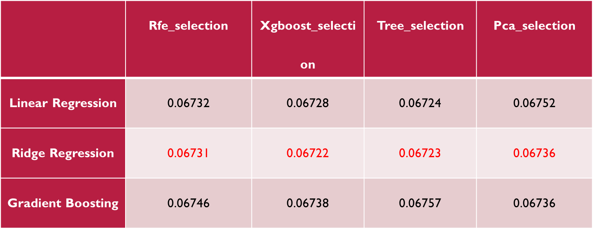

# Capstone - Zillow House Price Prediction

## Overview
Zillow is an online real estate database company founded in 2006 that provides an estimate system called Zestimate. The Zestimate system utilizes 7.5 million statistical and machine learning models to analyze various data points on each property, determining the price value for any given house. Kaggle participants will develop an algorithm that makes predictions about the future sale prices of homes. 

More information about this contest: https://www.kaggle.com/competitions/zillow-prize-1/overview

## Problem Statement
In this data science project, the task is to build a machine learning model based on the residuals of the Zestimate system. The target variable given in the dataset is the log-transformed error between the predicted price and the actual price of houses.

$$Log error = \log(\text{Predicted price}) - \log(\text{Actual Price})$$

## Data
The project uses two main datasets:
1. Transaction data - 2016: This file contains information on all the houses sold in 2016 across the state of California and the corresponding log error made by the Zestimate system.
2. Property data (27 million): This file includes details about the properties, such as mortgage records, tax assessments, physical features of the property (bed count, living area, age of the building), and location details.

## Exploratory Data Analysis
EDA involves understanding the data using various visualization techniques. 

- Serious missing value probelm: 35% of the attributes are missing more than 90% of values.

- Location analysis

- Heatmap to explore correlation

Refer to the EDA Jupyter notebook file attached for a detailed analysis.

## Impute Missing Values
A major challenge in dealing with the data was the high percentage of missing attributes (35% with more than 90% missing values). We use Knn Imputation (Euclidean distance) to handle the missing values:
Knn Imputation (Euclidean distance)
1. Imputation after join operation -90k 
2. Using KNN classifier and regressor to find better neighbors to impute

## Feature Engineering
Feature engineering involved creating new variables using variable interaction and feature selection using different approaches:

New features using variable interaction:
- Total rooms = bath_count + bedroom_count
- Average room size = total_finished_living_area_sqft / roomcnt
- Ratio of structure tax to land tax = structure_tax / land_tax
- ExtraSpace = lot_area_sqft - total_finished_living_area_sqft

Feature Selection & Dimensionality Reduction:
- Recursive Feature Elimination (RFE)

<!--  -->

- XgBoost feature importance (Information Gain & Gini Index)

<!--  -->

- TreeRegressor feature importance (Information Gain & Gini Index)
<!-- 
 -->

- Principal Component Analysis (PCA)

<!--  -->

Result of Dimensionality Reduction:
<!-- 
 -->

## Model Building & Fine Tuning
We will use Linear regression, Ridge regression, Gradient boosting decision tree tuned with gridsearchcv to conduct regression task. They are conducted based on four groups of attributes selected by feature engineering: rfe_selection, xgboost_selelction, tree_selection, pca_selection respectively.
The whole data is divided into train 90% and test 10%, models are built on train data using cross-validation techniques.

## Results

The models' performance on different feature selection approaches and PCA are as follows:

For each selection, Ridge regression has the lowest MAE.

## Inferences and Future Improvements
- The main challenge was building the model based on the residuals of a powerful machine learning model (Zestimate system).
- The amount of missing information in each attribute also contributed to the model's limitations.
- Hardware limitations prevented building an imputation model using all 27 million records.
- Exploring different feature selection techniques and leveraging xgboost's inbuilt ability to handle missing values could be potential future improvements.
- Further investigation is needed to improve the linear regression model's R squared value, which suggests it couldn't effectively explain the underlying data.
